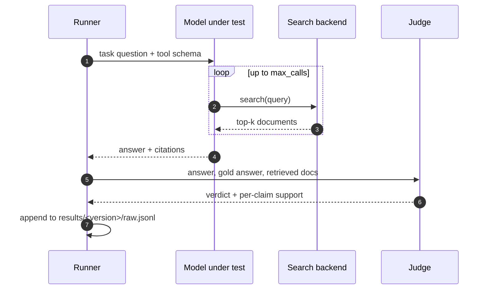

# Run pipeline

One run is a pure function of (task set, model, harness config, judge). Anything
that is not one of those four is a bug.



## Determinism

Fixed across every model in a release:

- `temperature = 0`, `top_p = 1`
- `max_calls = 6` search calls per task
- `top_k = 5` documents per search
- a frozen retrieval snapshot, so the index cannot shift mid-run

Models that do not expose temperature are run three times and the modal verdict
is taken; the run log records which models this applied to.

## Outputs

```text
results/
└── v0.1.0/
    ├── raw.jsonl        # one line per (model, task): answer, citations, tokens
    ├── summary.json     # the aggregate this site renders
    └── manifest.json    # model ids, judge id, harness commit, run date
```

`manifest.json` is what makes a claim checkable: it pins the exact model IDs and
the harness commit that produced the numbers.
