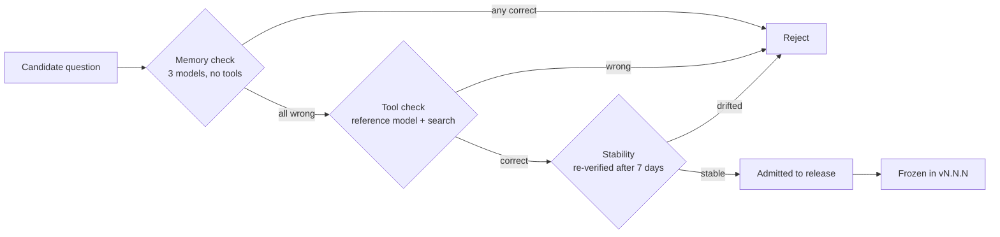

# Task design

Each task is a triple: a question, a gold answer, and a gold source set.

```json
{
  "id": "t-041",
  "question": "Which company acquired the maintainer of the `sharp` npm package, and in what year?",
  "gold_answer": "...",
  "gold_sources": ["https://example.org/a", "https://example.org/b"],
  "category": "multi-hop",
  "freshness_cutoff": "2026-01-01"
}
```

## The four categories

| Category | Share | What it stresses |
| --- | --- | --- |
| Single-hop lookup | 30% | Can it find one fact and stop? |
| Multi-hop | 30% | Can it chain two retrievals without losing the thread? |
| Freshness | 20% | Does it prefer a recent source over a stale memory? |
| Negative | 20% | Will it say "no reliable source says this"? |

The negative tasks matter most. A model that never refuses scores well on the
first three categories and still cannot be trusted; the unsupported-claim rate
is where that shows up.

## Admission rules

A candidate task enters the set only if it clears all three:

1. **Not answerable from memory.** Three baseline models, no tools, all wrong.
2. **Answerable with the tool.** At least one reference model gets it right with
   search enabled.
3. **Stable gold.** The answer does not change between two runs a week apart.

Rule 1 is the expensive one and the one most benchmarks skip. Without it,
accuracy measures pretraining recall, not search.

## Task lifecycle


