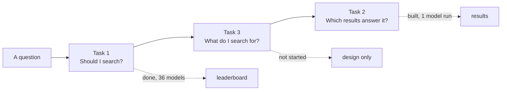

# Where the project stands

As of **2026-09-23**. This page exists so nothing lives only in someone's head:
what works, what does not, what was tried and rejected, and what is next.

## The three tasks

| Task | State |
| --- | --- |
| [Tool-use correctness](./tasks/tool-use-correctness/) | **Done.** 360 items, 36 models run, leaderboard published. |
| [Search-result discrimination](./tasks/search-result-discrimination/) | **Built and running.** 331 items, 199 scorable, one model run end to end. |
| [Search quality](./tasks/search-quality) | **Design only.** No data, no code. |

## Task 1 — tool-use correctness

360 items in three buckets of 120: `memory` (the model should already know it),
`search` (it cannot), `no_tool` (nothing to look up). 29 items are worded to
bait a search that is not needed.

The search tool is **offered and never executed**. The moment a model reaches
for it, the episode ends and the call is recorded. That is what keeps the task
cheap, offline and free of a search vendor's ranking.

Results are on the [leaderboard](./results/leaderboard), with
[charts](./results/explore) and [a page per item](./examples/).

### What was learned running it

- **A failed item is not a decision.** A model that errored on all 360 items
  once scored 67% mid-table, because "did not search" is correct on two buckets
  out of three. Failures are now recorded, not scored, and a rerun retries them.
- **Silence is not a decision either.** 478 items across 17 models came back
  with no text and no tool call — a reasoning model that spent its whole budget
  thinking, or OpenRouter returning `content: null` with everything in
  `reasoning`. Those were being scored as "chose not to search". Now they are
  failures. The token budget went from 4096 to 8192 as part of the fix.
- **Some models write tool calls as prose.** Qwen's coder models emit
  `<function=search><parameter=query>…` because the provider serves them
  without a matching parser. That is a decision to search and now counts as
  one, with a `text-call` problem recorded against the call itself.

## Task 2 — search-result discrimination

A question, a fixed candidate set, and **one thing scored: was the answer
right?** Two ways to be right — the results contain the answer and the model
gave it, or they do not and the model said so.

331 items, **199 scorable**:

| Category | Items | Scorable | Answers come from |
| --- | ---: | ---: | --- |
| `wikipedia` | 120 | 120 | HotpotQA's own answers |
| `web` | 171 | 39 | written by Claude from human-graded passages |
| `no_answer` | 40 | 40 | none — the right answer is that there is none |

### The one run so far

`qwen/qwen3.8-27b`, all 199 items: **72.4% correct** — 76.7% wikipedia, 66.7%
web, 65.0% no_answer. It answered 14 times out of 40 when a human had rejected
every result, and refused 7 times when the answer was there.

### What this task deliberately does not measure

It measured four things at once — ranking quality (nDCG@10), evidence
selection (precision/recall/F1), abstention, and the answer — and could say
nothing clean about any of them. nDCG in particular sat at 93–99% for every
model including one that failed two thirds of its requests, so it separated
nobody.

All of that was removed. The model is asked for an answer and nothing else.

## Known-good and known-broken providers

Measured on 2026-09-23. All of this moves; re-check before trusting it.

| Provider | State |
| --- | --- |
| OpenRouter, paid | works, the default route |
| `moonshot/kimi-*` | works — **send no `temperature`**, the API rejects any value but 1 |
| `avey/olive` | works on `/llm/responses`, **not** on `/llm/chat/completions`; rate-limited to roughly one item per seven minutes |
| `qwen/qwen3.8-27b:free` | upstream pool exhausted; returns nothing |
| `google/gemma-4-31b-it:free` | 50 of 67 requests rate-limited |
| `nvidia/nemotron-3-super-120b-a12b:free` | usable, intermittent 429s |

**Schema enforcement:** 34 of 41 catalogued OpenRouter models accept a JSON
schema (`structured_outputs`), 4 promise JSON only, 3 promise nothing — and
three of those seven are reasoning models. Recorded with its date in
`data/model_capabilities.json`; regenerate with `make capabilities`.

**Avey is stalled, not broken.** 29 of 360 items after hours of running, the
last one taking 430 seconds. Every request eventually succeeds. Raising the
rate limit on that key turns it into a few minutes of work; nothing on this
side will.

## Decisions worth not relitigating

**MS MARCO text is never committed.** Microsoft grants non-commercial research
use and extends no licence. The `web` and `no_answer` items are built locally
and git-ignored; a committed manifest of ids and SHA-256s makes a local build
verifiable. Everything needed to reproduce them is in the repository; the
passages are not.

**A gold answer must be a span of its passage.** The web category first scored
43.1%, and it was the labelling. Six-word answers came out telegraphic — `one
slice cheese vs two` — and no model phrases things that way, so correct answers
were marked wrong. Annotated answers are now checked for being copied from the
passage word for word. That dropped 11 of 24 queries, including every
comparison and cost range. Web then read 66.7%.

**Label provenance travels with the item.** `answer_source` is `dataset`,
`annotated` or `none`; `label_source` is `human` or `derived`. A validator
refuses an item carrying an answer without saying where it came from. Derived
and human labels are never averaged into one number silently.

**No LLM judge yet — by choice.** The design is written up under [how it is
graded](./tasks/search-result-discrimination/grading), including a decision
model (Jev) that cannot write text and so cannot invent evidence, and a
quote-verified generative judge for the audit sample. None of it runs. The
groundedness column is absent rather than zero.

## What is next

1. **Run task 2 across the field.** One model has been run. The leaderboard
   shape exists; it needs models.
2. **Wire the judge** when groundedness matters, and publish its agreement with
   a human on a 30-item sample as Cohen's κ before trusting it.
3. **Avey**, if the rate limit is raised.
4. **Task 3**, which needs a frozen corpus before it can be retriever-agnostic.
5. **More web answers**, if a better annotation rule than "copied span" can be
   found — 32 of 57 queries are still unusable because their answers are
   definitions.

## Operational notes

- `npm run build` is the only thing that checks links. The dev server serves an
  SPA fallback for every path, so a broken link returns 200 there.
- The dev server needs `NODE_OPTIONS=--max-old-space-size=8192`; 691 generated
  pages overflow Node's default heap in watch mode.
- MDX v3 rejects `## Heading {#id}` and HTML comments. Use the generated slug.
- A frontmatter `description` containing a colon must be quoted, or YAML reads
  it as a key and the whole docs version fails to load.
