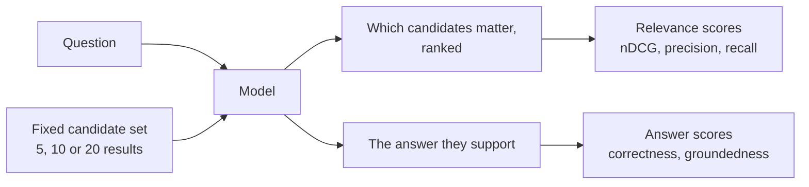

# Search-result discrimination

The first task asks whether a model knows *when* to search. This one starts
after the searching is over.

The model gets a question and a list of results. Some of them answer the
question. Most do not. Nobody tells it which is which.

:::info[Dataset built, runner not yet]

The task set — 331 items — is built and committed. The harness that puts it to
models, and the leaderboard, are not written yet. Everything on these pages
describes data you can read today in `tasks/search-result-discrimination.jsonl`.

:::

## The shape of one item

Here is a real item, `srd-wiki-5ab6e6c75542`, at the five-candidate tier:

> **What team had Tony Roberts replaced by an American sportscaster from
> Buffalo, New York when he retired?**
>
> **[1]** *Eli Gold* — Eli Gold (born December 15, 1953) is an American
> sportscaster. Gold is best known as…
>
> **[2]** *Spencer Ross* — Spencer Ross is an American sportscaster. With the
> exception of the New York Mets…
>
> **[3]** *Tony Roberts (sportscaster)* — Tony Roberts (born 1928) is an
> American retired sportscaster who was the play-by-play voice of…
>
> **[4]** *Don Criqui* — Don Criqui (born May 5, 1940, Buffalo, New York) is an
> American sportscaster, currently…
>
> **[5]** *John Murphy (sportscaster)* — John Murphy is an American sportscaster
> from Buffalo, New York. He is best known…

The answer is **Notre Dame Fighting Irish football**, and it takes candidates
**[3]** and **[4]** together to get there: [3] says who Tony Roberts was, [4]
says who replaced him and that he is from Buffalo.

Look at **[5]**. It is an American sportscaster from Buffalo, New York — every
descriptor in the question, in one sentence, about the wrong person. That is
what a hard negative looks like, and it is why keyword overlap is not a
strategy here.

## What the task measures

Two outputs, scored separately, because they are separate abilities. A model
that answers "Notre Dame Fighting Irish football" from memory without reading
anything has told you nothing about its reading. Asking it to name the
candidates it used is what closes that hole.

## Three categories

| Category | Items | Candidates come from | Labels |
| --- | --- | --- | --- |
| [`web`](./categories#web) | 171 | Web passages, TREC Deep Learning 2019 and 2020 | graded by human assessors, 0–3 |
| [`wikipedia`](./categories#wikipedia) | 120 | Wikipedia paragraphs, HotpotQA distractor split | derived from supporting facts |
| [`no_answer`](./categories#no_answer) | 40 | Web passages a human read and rejected | graded by human assessors, all 0 |

`no_answer` is the one most benchmarks leave out, and leaving it out teaches
the model a falsehood: that one of the results always contains the answer. Real
search does not promise that.

## Noise is the point

Every item exists at one of three sizes, and noise dominates all of them:

| Tier | Candidates | Relevant | Noise |
| --- | --- | --- | --- |
| easy | 5 | 1 | 4 |
| medium | 10 | 2 | 8 |
| hard | 20 | 4 | 16 |

Each `web` question is built at **all three** tiers with the same relevant
passages, so the fall-off with candidate count can be read within a single
question rather than across different ones.

## What this task is not

It is not a retrieval benchmark and it is not RAG. No retriever runs anywhere
in the pipeline: the candidates are fixed, committed, and identical for every
model, which is exactly what makes the comparison about the model.

It is also not tied to a search product. The candidates here happen to be web
passages and Wikipedia paragraphs; the format takes any source, and the
category dimension exists so more can be added without averaging them together.

Next: [the three categories](./categories), [what gets
measured](./metrics), [how the set was built](./building), and [what it cannot
tell you](./limitations).
