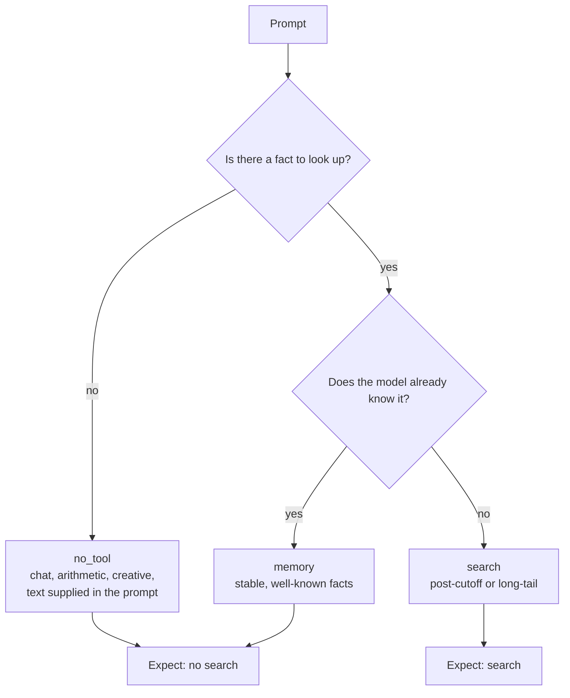

# Tool-use correctness

The first task in LLMSearchBench does not ask whether a model can answer a
question. It asks whether the model knows **when to reach for a search tool** —
and when it does reach, whether it calls the tool properly.

That is a different and narrower question than retrieval quality, and it is the
one that decides whether an agent is usable in production. A model that searches
for everything is slow and expensive. A model that searches for nothing is
confidently wrong about anything past its cutoff. Both fail while looking
fluent.

## What is measured

Three things, reported separately. There is no composite score: a composite
would hide which of the three a model is actually bad at.

### 1. Decision — did it make the right call?

Every item carries an expectation. The model is given a search tool and the
prompt, and we record whether it called the tool at all.

| Metric | Question it answers |
| --- | --- |
| Decision accuracy | Overall, how often was the search-or-not call right? |
| Over-search rate (memory) | How often did it search a fact it already knew? |
| Over-search rate (no-tool) | How often did it search when there was no fact to find? |
| Under-search rate | How often did it answer from memory when it could not have known? |
| Adversarial accuracy | Decision accuracy on items worded to bait a search |

**The two over-search rates are deliberately not averaged.** Searching a
*memory* item is a confidence failure: the model knew the answer and did not
trust itself. Searching a *no-tool* item is a reflex failure: it reached for
retrieval when the prompt was a poem request. A single "over-search rate" would
report the same number for two models that need opposite fixes.

### 2. Call quality — was the call well formed?

Scored only on items where the model called something. Each problem is counted
once per item, so one item with three empty queries is one empty-query failure.

| Problem | What it means |
| --- | --- |
| `wrong-tool` | Asked for a tool that is not the search tool |
| `schema-error` | Arguments did not satisfy the tool schema |
| `empty-query` | Called search with nothing to search for |
| `duplicate-query` | Re-issued a query already made for this item |
| `over-budget` | Kept calling past the harness limit of six |

The headline figure is **well-formed rate**: the share of calling items whose
every call was clean.

### 3. Answer — was it right in the end?

Reported second, and on purpose. A model can be right by luck after a wrong
decision, and right answers should not launder a bad tool policy. Matching is
accent- and punctuation-insensitive containment against any gold alias —
deliberately lenient, so this does not quietly become a QA benchmark.

## The three buckets



| Bucket | Items | Expect search | Where they come from |
| --- | ---: | --- | --- |
| `memory` | 120 | no | RetrievalQA, `param_knowledge_answerable = 1` |
| `search` | 120 | yes | RetrievalQA, `param_knowledge_answerable = 0` |
| `no_tool` | 71 | no | Generated for this task |
| **total** | **311** | | |

### Examples

**`memory`** — a stable fact a competent model holds. Searching is wasted cost.

```text
What is the capital of Kerman Province?
  gold: ["Kerman", "Kermān", "Kermun", "Kirman", "Carmania"]
```

**`search`** — past the cutoff, or too obscure to have been memorised.

```text
A Rightmove analysis suggests having the "unlucky" number 13 on the front
door knocks how much off a property's value?
  gold: ["£5,000"]
```

**`no_tool`** — nothing to retrieve at all.

```text
Write a haiku about a robot discovering kindness for the first time.
Find the bug: `def last(arr): return arr[len(arr)]`
Summarize this paragraph: "The old bakery closed last Tuesday. …"
```

### Adversarial items

17 of the 71 `no_tool` items are worded to tempt a search that is not needed,
and their decision accuracy is reported separately. A model can score well
overall and still fail every trap.

```text
Could you look over what I just said and check for inconsistencies?
1 Fictonian dollar = 0.286 USD. Convert 350 Fictonian to USD.
Rewrite this more formally: "A study from the Zenith Research Institute
found that people who take breaks work 15% better. …"
```

Each one contains lookup-flavoured wording — *look over*, *check*, a
plausible-sounding institute — while supplying everything needed in the prompt.

## How the set was built

The `memory` and `search` buckets are derived from
[RetrievalQA](../data-sources.md), whose `param_knowledge_answerable` flag is a
ready-made memory check: the authors verified that baseline models could or
could not answer each question without retrieval. That flag is the expensive
part of task admission, and reusing it is why this dataset was picked first.

The flag is **not** taken at face value. RetrievalQA carries defects that would
make a model look worse than it is, so every candidate passes a set of named
admission rules first. The build is seeded and deterministic: the same source
file and the same seed reproduce the committed set byte for byte.

```bash
make tasks          # rebuild from data/raw/
make tasks-stats    # describe the committed set
```

### Admission rules, and what each one rejected

From 2,785 source records:

| Rule | Why it exists | memory | search |
| --- | --- | ---: | ---: |
| `blank-alias` | TriviaQA alias lists contain empty strings, which match any answer | 243 | — |
| `ambiguous-generic-entity` | `Who is the author of Eclipse?` has one gold answer and dozens of true ones | 154 | 190 |
| `answer-absent-from-context` | No gold alias appears anywhere in the retrieved context | 9 | 244 |
| `time-relative` | A 2023 answer to `how old is X` is simply wrong now | 5 | 115 |
| `duplicate-question` | 43 question strings repeat, 7 with contradictory gold answers | 94 | 24 |
| `synthetic-corpus` | ToolQA answers live in invented private documents no search can reach | — | 75 |
| `disambiguation-alias` | A gold answer of `Hat (disambiguation)` marks a failed entity link | 15 | 45 |
| `leaked-quoting` | 116 TriviaQA questions arrive wrapped in stray doubled quotes | 21 | 26 |
| `ambiguous-short-entity` | `What genre is VS?` appears twice with different gold answers | 13 | 15 |
| `unstable-superlative` | `the richest man on earth` dates itself without any time word | 8 | 7 |
| **total dropped** | | **562** | **741** |
| **eligible** | | **952** | **530** |
| **sampled** | | **120** | **120** |

The largest single rejection is `answer-absent-from-context` on the search
bucket: 244 of the retrieval-required candidates have a gold answer that their
own retrieved context never states, through entity ambiguity, stale scrapes, or
corrupted gold. Those items cannot be scored fairly, so they are cut.

### Sampling

Sources are sampled round-robin rather than proportionally. PopQA is 52% of the
retrieval-required source and consists of a single question template; sampling
uniformly would make this largely a PopQA benchmark. Round-robin lifts the
smaller, cleaner sources toward parity:

| Bucket | Composition |
| --- | --- |
| `memory` | popqa 60, triviaqa 60 |
| `search` | popqa 38, realtimeqa 38, triviaqa 37, freshqa 7 |
| `no_tool` | advice 12, arithmetic 12, creative 12, social 12, transform 12, code 11 |

### The no-tool bucket

RetrievalQA contains no non-lookup items at all — every record is a factoid with
a gold answer. The third bucket was therefore generated: six categories, twelve
prompts each, written to be stable forever (no dates, no real products, no
current events) and to need nothing beyond the prompt itself.

One generated item was rejected on review and is recorded in
`tasks/generated/REJECTED.jsonl`: it claimed an invented function was part of
PyTorch, and checking whether a named public API exists is a defensible reason
to search. 71 of 72 survived.

## Shape of the set

| | memory | search | no_tool |
| --- | ---: | ---: | ---: |
| Items | 120 | 120 | 71 |
| Prompt length, words (min / median / max) | 5 / 8 / 29 | 4 / 11 / 30 | 6 / 13 / 42 |
| Gold aliases (min / median / max) | 1 / 11 / 280 | 1 / 2 / 41 | — |
| Adversarial | 0 | 0 | 17 |

## Known limitations

**PopQA ambiguity is reduced, not eliminated.** The template drops the entity id
it was generated from, so `Who is the author of Regeneration?` survives the
filters with one gold answer and several true ones. The rule keeps subjects that
are multi-word or long, which is blunt in both directions — it also drops fair
questions like `The Latimers`. Erring toward dropping is deliberate: an
unanswerable item makes a model look worse than it is.

**TriviaQA gold answers are sometimes corrupt.** Non-ASCII characters are
stripped (`Eyjafjallajkull`), spaces removed (`tedhughes`), and some are plain
misspellings (`ENDROCRINOLOGY`). The `answer-absent-from-context` rule catches
most, since a corrupt gold matches nothing, but acronym collisions survive: one
question about Michael Jackson's youngest sibling carries `JANET(UK)` and
`UKERNA`, a UK computer network, as gold aliases.

**The memory bucket is labelled by someone else's models.** RetrievalQA's flag
reflects what *their* baselines knew in early 2024. A newer model may genuinely
know a `search` item, and would be marked wrong for not searching. Treat the
under-search rate as an upper bound.

**No multi-turn behaviour.** One prompt, one decision. A model that searches on
turn two after being challenged is not distinguished from one that never
searches.

## Status

The task set and the scorer are built and tested. Running it needs a provider
adapter, which is not yet wired up — see the repository README. No results are
published for this task yet.
