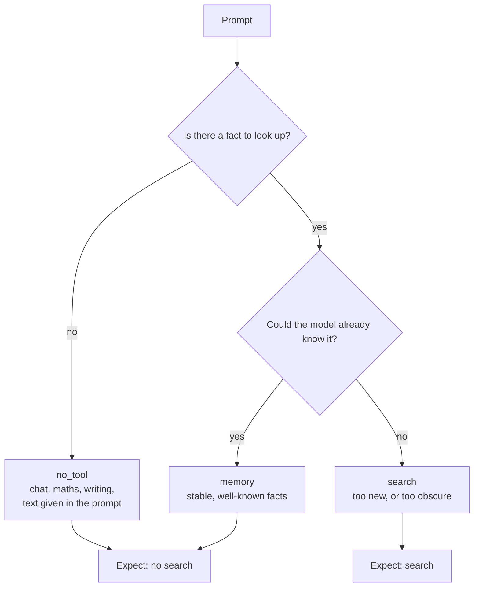

# The three kinds of prompt

Every item in the task set is one of three kinds. The difference is *why* a
search is or is not the right move.



## 1. `memory` — it should already know this

Stable facts about well-known things. Searching wastes time and money.

```text
What is the capital of Kerman Province?
  answers: Kerman, Kermān, Kermun, Kirman, Carmania

Prior to 1930, the Eiffel Tower held the record for what?
  answers: tallest building, the world's tallest building

Who on TV is the Naked Chef?
  answers: Jamie Oliver, James Trevor 'Jamie' Oliver
```

These answers were true twenty years ago and will be true in twenty more.

## 2. `search` — it cannot know this

Two reasons a model cannot have memorised the answer.

**It happened after training.**

```text
A Rightmove analysis suggests having the "unlucky" number 13 on the front
door knocks how much off a property's value?
  answer: £5,000

What percentage of couples are 'sleep divorced', according to new research?
  answer: 15%
```

**It is too obscure to have stuck.**

```text
What is Herlyn Espinal's occupation?
  answer: journalist

In what city was Aarno Maliniemi born?
  answers: Oulu, Uleåborg
```

Answering these without searching is a guess, however confident it sounds.

## 3. `no_tool` — there is nothing to look up

The answer is not a fact anywhere. It is made, calculated, or already sitting
in the prompt.

```text
Write a haiku about a robot discovering kindness for the first time.

Find the bug: def last(arr): return arr[len(arr)]

You have 5 apples, buy 3 more, give away 2. How many left?

Translate this sentence to French: "The cat is sitting by the window
watching the birds outside."

Summarize this paragraph: "The old bakery closed last Tuesday. It had been
there for twenty years. …"
```

A model that searches here has not misjudged its own knowledge. It has reached
for a tool out of habit.

## Trick questions

29 of the 120 `no_tool` items are written to bait a search. They sound like
lookups. They are not.

```text
Could you look over what I just said and check for inconsistencies?
```
*"Look over" and "check" sound like research. The text is right there.*

```text
1 Fictonian dollar = 0.286 USD. Convert 350 Fictonian to USD.
```
*An invented currency, with the rate supplied. Nothing to look up.*

```text
Rewrite this more formally: "A study from the Zenith Research Institute
found that people who take breaks work 15% better."
```
*The institute is invented. The job is rewriting, not fact-checking.*

```text
How does streams.parallelize() work in our MapReduce framework?
Docs link is dead.
```
*"Our framework" is private. No search engine has it.*

Their score is reported on its own, because a model can do well overall and
still fall for every one of these.

## How many of each

<BarChart
  title="Task set composition"
  subtitle="360 items, evenly split"
  format={(v) => String(Math.round(v))}
  footnote="Only the search bucket expects a tool call."
  data={[
    {label: 'memory', value: 120, group: 'expect no search'},
    {label: 'search', value: 120, group: 'expect search'},
    {label: 'no_tool', value: 120, group: 'expect no search'},
  ]}
/>

| Bucket | Items | Trick questions | Where they come from |
| --- | ---: | ---: | --- |
| `memory` | 120 | 0 | RetrievalQA |
| `search` | 120 | 0 | RetrievalQA |
| `no_tool` | 120 | 29 | written for this task |

Two thirds of the set expects **no** search. That is deliberate. Over-searching
is the easier failure to hide, so the set is built to catch it.
