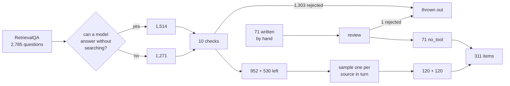

# How the set was built

## The starting point

[RetrievalQA](../../data-sources.md) is 2,785 questions. Each one carries a flag
the authors worked out by testing: **can a model answer this without
searching?**

That flag is exactly what this task needs, and it is the expensive part to
produce. It is why this dataset was used first.

```text
param_knowledge_answerable = 1  ->  memory bucket   (1,514 questions)
param_knowledge_answerable = 0  ->  search bucket   (1,271 questions)
```

## But the source has problems

The flag is trusted. The questions are not. Reading the data turned up
questions that no model could answer fairly, and scoring a model against them
would make it look worse than it is.

So every candidate has to pass ten checks first. Each one exists because of
something actually found in the data.

### Check 1 — is the accepted answer even in the source material?

The single biggest cut. 244 search-bucket questions have an answer that never
appears in their own supporting text.

```text
Q: What is John Barnes's occupation?
   accepted answer: monk

   supporting passages:
     "John Barnes (musician) — English jazz saxophonist…"
     "John Barnes (athlete) — American middle-distance runner…"
     "John Barnes — former professional football player…"
```

Twenty-five passages, no monk. The question does not say *which* John Barnes.

### Check 2 — is the question about a specific thing?

PopQA builds questions from a template plus an entity name. Sometimes the name
is too generic to identify anything.

```text
Q: Who is the author of Eclipse?
   accepted answer: James Swallow

Q: What genre is VS?
   accepted answer: pop music
```

Dozens of books are called *Eclipse*. The question dropped the specific one it
meant. Rejected: 154 memory, 190 search.

### Check 3 — will the answer still be true next year?

```text
Q: How old is Donald Trump?          accepted: 77
Q: Who is the richest man on earth?  accepted: Bernard Arnault
Q: What Berber year is the present year?  accepted: 2974
```

All correct when scraped. All wrong now. Rejected: 115 search, 5 memory — plus
a few more that date themselves without any time word, like "richest".

### Check 4 — can a search engine actually find it?

ToolQA questions are answerable only from invented private documents.

```text
Q: What time did Grace attend Broadway Show on 2022/02/17?

   supporting text: "Grace has a Broadway Show event on February 17, 2022
   at Richard Rogers Theater. The show will start at 8:00 PM…"
```

Grace is not a real person. No search engine has her calendar. A model that
correctly decides to search would then be marked wrong for not finding it. All
75 rejected.

### Check 5 — is the accepted answer list usable?

TriviaQA answer lists sometimes contain an empty string, which matches *any*
response. 243 memory-bucket questions rejected for this alone — the largest
single cut in that bucket.

```text
Q: The SS Titanic sank in which year?
   accepted: ["", "one thousand nine hundred and twelve", …]
              ^^ matches everything
```

### The rest

| Check | What it catches | memory | search |
| --- | --- | ---: | ---: |
| `blank-alias` | empty string in the answer list | 243 | — |
| `ambiguous-generic-entity` | "the author of *Eclipse*" | 154 | 190 |
| `answer-absent-from-context` | answer not in its own source text | 9 | 244 |
| `time-relative` | "how old is X", "the latest Y" | 5 | 115 |
| `duplicate-question` | same question, different answers | 94 | 24 |
| `synthetic-corpus` | invented private documents | — | 75 |
| `disambiguation-alias` | answer is `Hat (disambiguation)` | 15 | 45 |
| `leaked-quoting` | `"What does ""Sinn Fein"" mean?"` | 21 | 26 |
| `ambiguous-short-entity` | "What genre is VS?" | 13 | 15 |
| `unstable-superlative` | "the richest man on earth" | 8 | 7 |
| **total thrown out** | | **562** | **741** |
| **left over** | | **952** | **530** |
| **used** | | **120** | **120** |

<BarChart
  title="Why search-bucket questions were rejected"
  subtitle="741 of 1,271 thrown out"
  format={(v) => String(Math.round(v))}
  labelWidth={210}
  footnote="Each question is counted against the first check it fails. Biggest cause first."
  data={[
    {label: 'answer-absent-from-context', value: 244},
    {label: 'ambiguous-generic-entity', value: 190},
    {label: 'time-relative', value: 115},
    {label: 'synthetic-corpus', value: 75},
    {label: 'disambiguation-alias', value: 45},
    {label: 'leaked-quoting', value: 26},
    {label: 'duplicate-question', value: 24},
    {label: 'ambiguous-short-entity', value: 15},
    {label: 'unstable-superlative', value: 7},
  ]}
/>

<BarChart
  title="Why memory-bucket questions were rejected"
  subtitle="562 of 1,514 thrown out"
  format={(v) => String(Math.round(v))}
  labelWidth={210}
  footnote="Answer lists containing an empty string are the single biggest cause."
  data={[
    {label: 'blank-alias', value: 243},
    {label: 'ambiguous-generic-entity', value: 154},
    {label: 'duplicate-question', value: 94},
    {label: 'leaked-quoting', value: 21},
    {label: 'disambiguation-alias', value: 15},
    {label: 'ambiguous-short-entity', value: 13},
    {label: 'answer-absent-from-context', value: 9},
    {label: 'unstable-superlative', value: 8},
    {label: 'time-relative', value: 5},
  ]}
/>

## Picking 120 from what is left

530 search questions survived, but they are not evenly spread. PopQA alone is
half of them, and every PopQA question is the same template.

So the sample takes one from each source in turn, rather than in proportion.
Small, cleaner sources get lifted toward parity:

<BarChart
  title="Where the search bucket comes from"
  subtitle="One picked from each source in turn"
  format={(v) => String(Math.round(v))}
  footnote="PopQA is half the eligible pool and ends at under a third of the bucket."
  data={[
    {label: 'popqa', value: 38, group: 'templated'},
    {label: 'realtimeqa', value: 38, group: 'real web pages'},
    {label: 'triviaqa', value: 37, group: 'templated'},
    {label: 'freshqa', value: 7, group: 'real web pages'},
  ]}
/>

## The no-tool bucket

RetrievalQA has nothing usable here. Every one of its 2,785 records is a
factual question with an answer. There are no poems, no sums, no "summarise
this".

So these 71 were written for the task, twelve per category, in six categories:

| Category | Example |
| --- | --- |
| social | *I had such a productive day!* |
| arithmetic | *If 1 km = 1000 meters, how many meters in 7.5 km?* |
| creative | *Invent a magical plant species with three properties and a name.* |
| transform | *Translate this sentence to French: "The cat is sitting by the window…"* |
| code | *Find the bug: `def last(arr): return arr[len(arr)]`* |
| advice | *Job A: remote, $80k, startup. Job B: office, $90k, Fortune 500. Which?* |

Every one is written to stay valid forever: no dates, no real products, no
current events.

One was thrown out on review. It asked about an invented function while
claiming it was part of PyTorch — and checking whether a real library has a
given function *is* a fair reason to search. It is kept, with the reason, in
`tasks/generated/REJECTED.jsonl`.

## The whole pipeline



## Rebuilding it

```bash
make data     # fetch the source datasets
make tasks    # rebuild
```

The sample uses a fixed seed, so rebuilding gives the identical file every
time. A test checks exactly that.
