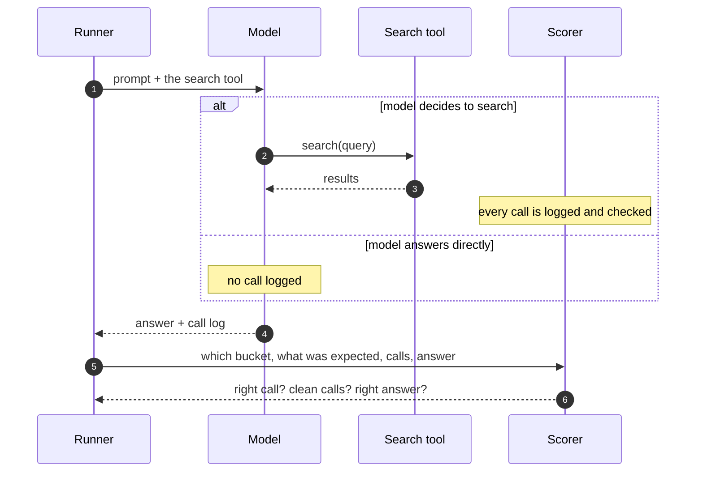

# What we measure

Three scores. They stay separate — there is no single overall number.

A combined score would hide the thing you need to know. Two models can both
score 70% and need opposite fixes.

## 1. Did it make the right call?

For each item, did the model search when it should have?

Write $s_i = 1$ if the model searched on item $i$, and $e_i = 1$ if it should
have. Then over all items $I$:

$$
\mathrm{DecisionAccuracy} = \frac{1}{|I|}\sum_{i \in I} \mathbb{1}\!\left[\, s_i = e_i \,\right]
$$

In words: count the items it got right, divide by the total.

That one number is not enough. **Searching when you should not** and **not
searching when you should** are different bugs, so they are counted separately:

$$
\mathrm{OverSearch}(B) = \frac{\bigl|\{\, i \in B : s_i = 1 \,\}\bigr|}{|B|},
\qquad B \in \{\texttt{memory},\ \texttt{no\_tool}\}
$$

$$
\mathrm{UnderSearch} = \frac{\bigl|\{\, i \in \texttt{search} : s_i = 0 \,\}\bigr|}{|\texttt{search}|}
$$

And over-searching is reported once per bucket, not once overall:

| Metric | What a high number means |
| --- | --- |
| Over-search on `memory` | The model knows the answer but does not trust itself |
| Over-search on `no_tool` | The model reaches for the tool out of reflex |
| Under-search | The model invents answers it cannot possibly know |

Those need different fixes. A single "over-search rate" would give both models
the same score.

## 2. Was the call well formed?

Only scored on items where the model called something. Five things can go
wrong:

| Problem | Example of a bad call |
| --- | --- |
| `wrong-tool` | `calculator(expr="2+2")` when only `search` exists |
| `schema-error` | `search(q="...")` when the argument is named `query` |
| `empty-query` | `search(query="")` |

Each problem counts once per item.

The headline number is the share of calling items with nothing wrong. Let $C$
be the items where the model called anything, and $P_i$ the problems found on
item $i$:

$$
\mathrm{WellFormed} = \frac{\bigl|\{\, i \in C : P_i = \varnothing \,\}\bigr|}{|C|}
$$

Note the denominator is $|C|$, not $|I|$. A model that never calls the tool has
no call quality to measure. Scoring it 100% would reward it twice for the same
behaviour.

## 3. Was the answer right?

Reported **last**, and that ordering is the point. A model can get the right
answer after a wrong decision — it guessed and got lucky. A right answer should
not paper over a bad tool policy.

$$
\mathrm{AnswerAccuracy}(B) = \frac{1}{|B|}\sum_{i \in B}
\mathbb{1}\!\left[\, \exists\, g \in G_i : \phi(g) \subseteq \phi(a_i) \,\right]
$$

$G_i$ is the accepted answers, $a_i$ is what the model said, and $\phi$ strips
accents, case, and punctuation. So "Leoš Janáček" matches the accepted answer
"Leos Janacek". Any one accepted answer appearing anywhere in the response is
enough.

This is loose on purpose. Tighten it and this stops being a tool-use task and
becomes a quiz.

`no_tool` items have no right answer, so they are not scored here.

## A worked example

:::warning[Invented numbers]
Nothing below is a real result. The numbers exist to show the arithmetic.
:::

Say a model runs the full 360 items and behaves like this:

| Bucket | Items | Searched | Correct decision |
| --- | ---: | ---: | ---: |
| `memory` | 120 | 30 | 90 |
| `search` | 120 | 108 | 108 |
| `no_tool` | 120 | 12 | 108 |

Then:

- **Decision accuracy** = $(90 + 108 + 108) / 360 = 306/360 = 85.0\%$
- **Over-search on `memory`** = $30/120 = 25.0\%$
- **Over-search on `no_tool`** = $12/120 = 10.0\%$
- **Under-search** = $(120 - 108)/120 = 10.0\%$

Read that as: the model is reasonable overall, but it does not trust its own
knowledge. One in four questions it could have answered outright, it looked up
anyway. The reflex problem is much smaller — it rarely searches when there is
no fact at all.

Now suppose it called the tool on 150 items, and 12 of those had a problem:

- **Well-formed rate** = $(150 - 12)/150 = 92.0\%$

The three scores together say: *decent judgement, poor self-confidence, mostly
clean calls.* A single blended score would have said "85%" and told you nothing
about what to fix.

## How one item is scored

