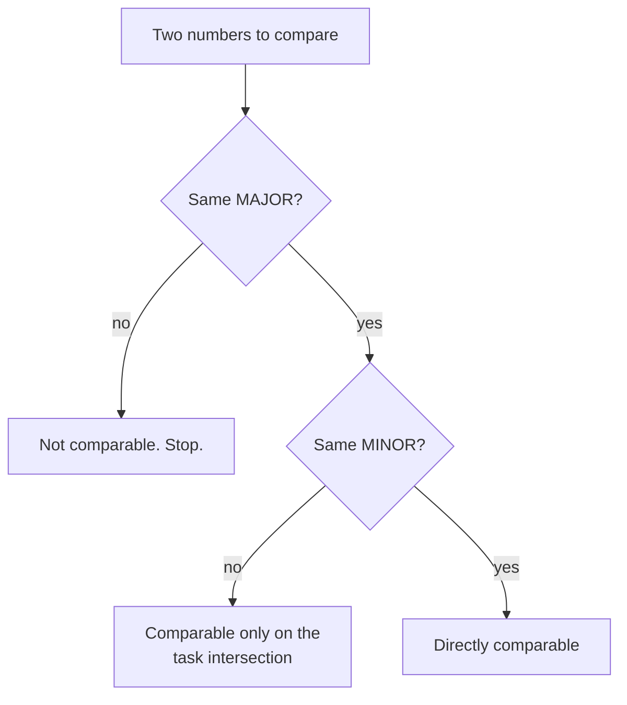

# Versioning policy

Two things version independently, and conflating them is how benchmarks end up
with numbers nobody can place.

| What | Versioned by | Lives in |
| --- | --- | --- |
| **The benchmark** — tasks, judge, harness, and the numbers they produce | a release tag `vMAJOR.MINOR.PATCH` | `results/<version>/` and `docs/src/data/releases/` |
| **These pages** — the prose describing the method | Docusaurus docs versions | `docs/versioned_docs/` |

A release freezes the numbers. Cutting a docs version freezes the description
of how they were produced. You do both at the same moment, but they are separate
commands.

## What each bump means

- **PATCH** — a broken task removed, a typo in a gold answer. Numbers shift
  slightly; comparisons to the previous patch stay valid.
- **MINOR** — tasks added, categories rebalanced. Numbers are comparable *within*
  the release only. Do not plot a MINOR against its predecessor on one axis.
- **MAJOR** — the judge model, the scoring definition, or the retrieval backend
  changed. Old numbers are void; nothing carries over.

The judge model is part of the release identity. Swapping it is always a MAJOR
bump, even when the task set is untouched.

## Cutting a release

```bash
# freeze the current prose as the outgoing version
cd docs
npm run version:cut -- v0.1.0

# then in docusaurus.config.ts, relabel `current` to the new version
```

After that, `content/` is the in-progress next version and
`versioned_docs/version-v0.1.0/` is immutable. Fix a typo in a shipped version
by editing the versioned copy directly.

## Comparing across releases



Every release publishes the task-ID intersection with its predecessor, so the
middle case is computable rather than a judgement call.
